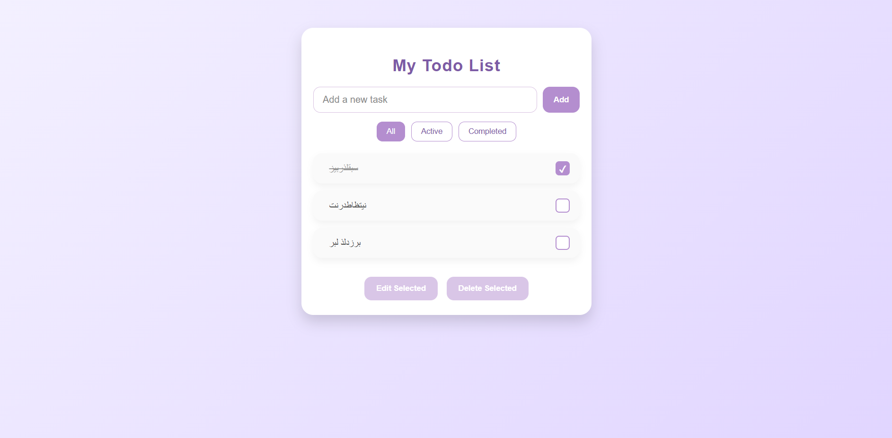

# Advanced Todo List (Vanilla JavaScript)

A feature-rich Todo List application built with vanilla JavaScript, HTML, and CSS.  
Demonstrates skills in DOM manipulation, LocalStorage persistence, event handling, responsive design, and basic UI/UX principles.

---

## Features

- Add, edit, and delete tasks
- Mark tasks as completed
- Filter tasks by All / Active / Completed
- Select tasks for editing or deleting
- Modal-based editing interface
- Persist tasks using LocalStorage
- Keyboard shortcut: Escape to deselect or close modal
- Responsive design for both mobile and desktop

---

## Technologies Used

- JavaScript (ES6)
- HTML5
- CSS3

---

## How to Use

1. Clone the repository:
   ```bash
   git clone <your-repo-url>
   ```
2. Open index.html in a browser

3. Add tasks using the input field and "Add" button

4. Click on a task to select it, then use "Edit Selected" or "Delete Selected"

5. Click the tick button to mark a task as completed

6. Use the filter buttons to view All, Active, or Completed tasks

## Screenshots



## Resume Summary

Implemented a feature-rich Todo List application using vanilla JavaScript, HTML, and CSS, demonstrating CRUD operations, LocalStorage persistence, task filtering, modal-based editing, and responsive UI design.

